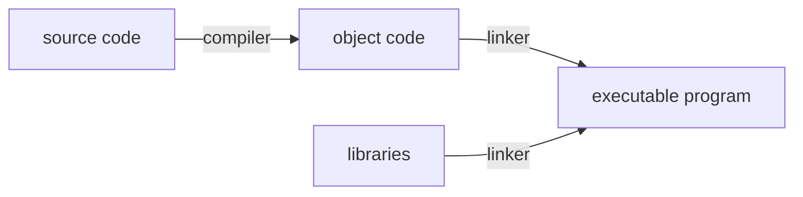

# Introduction

## why learn c++?

## modern c++

C++11 and the versions backward are reagrdes as modern c++.

## how does all this work

You must tell the computer exactly what to do without any ambiguity.

**source code**:higher level than computer code since it needs to be understandable by humans.

**editor**:used to enter program text,c++ has extensions like ``.cpp`` and ``.h``.

**object code**:binary or other low-level representation  which is for computer.

**compiler**:translates from high-level to low-level when the source code has no error.

**linker**:links together object code with other libraries and creates executable program.

**testing and debugging**:finding and fixing program errors.

### Integrated Development Environments(IDE)
- Editor
- Compiler
- Linker
- Debugger
- Keep everything in sync and control version